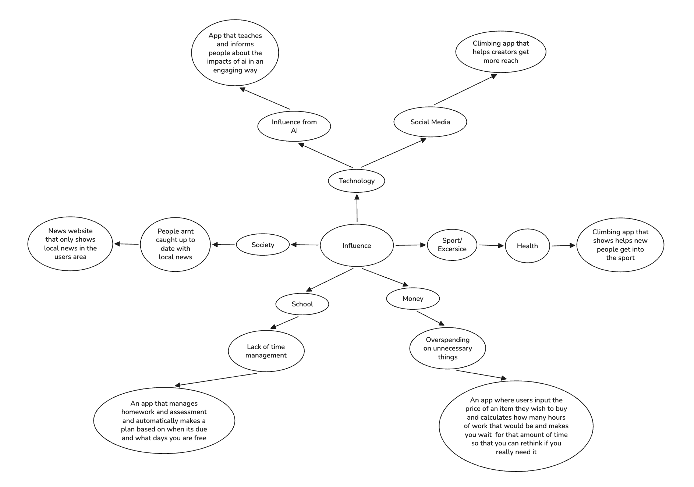
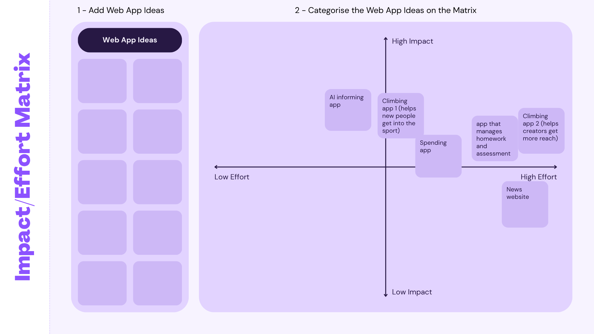
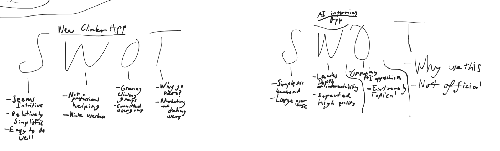
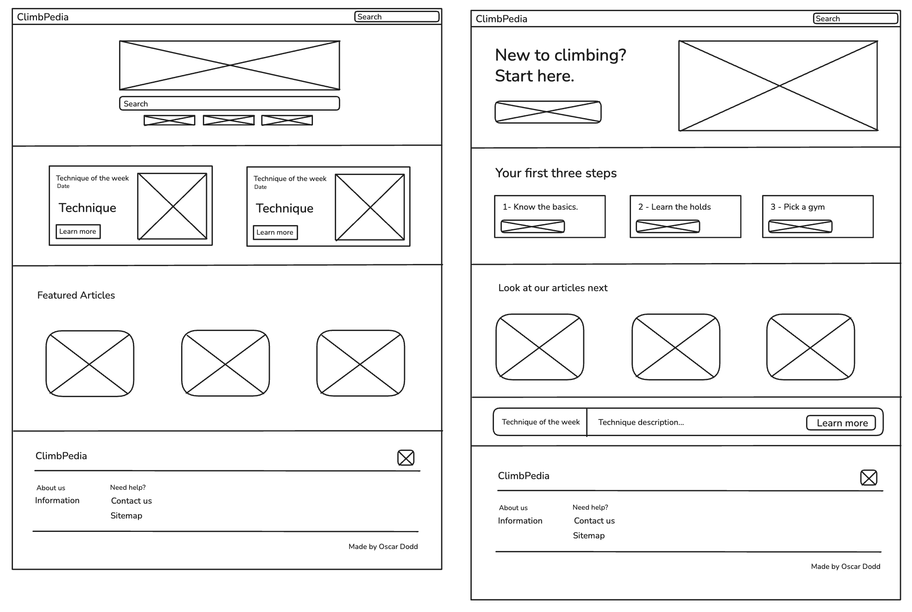

# Identifying and Defining

## Mindmap

## Ideas
| Idea Name | What It Does | Influence it Explores | Who It Helps |
| :---- | :---- | :---- | :---- |
| Climbing app that shows helps new people get into the sport | A climbing app that has technique tutorials to help beginners get into the sport, users can also log their climbs so | Health | People of all ages who are wanting to get into a new sport and stay fit |
| Climbing app that helps creators get more reach | The user adds \#climbingreach or some hashtag to their video on whatever platform and it will appear on the website. Their video will appear in a random order so that it is not affected by the algorithm so videos with little popularity are still seen. | Social media | New to Experienced content creators who want to get more reach on social media |
| News website that only shows local news in the users area | The website automatically checks for news around your location and displays them | People not being caught up to date with local news | People who may not be aware of things happening in their area |
| An app that manages homework and assessment and automatically makes a plan based on when its due and what days you are free | The app manages homework and assessment and automatically makes a plan based on when it's due and what days you are free. The user inputs what days they are free and the homework and assessments they have and when they are due and it will make a plan. | Lack of time management | People who struggle with time management |
| App that teaches and informs people about the impacts of ai in an engaging way | The app will have a list of facts that inform the user, and a small quiz that has a lot of facts that people may not know so that they realise the impacts of AI. | Influence from AI | People who are unaware of the impact of AI |
| App that tries to prevent unnecessary spending on things | users input the price of an item they wish to buy and calculates how many hours of work that would be and makes you wait  for that amount of time so that you can rethink if you really need it, it could work as a browser extension which automatically detects when payment buttons and locks them for an amount of time. | Overspending on unnecessary things | People who spend a lot of money |

## Impact/Effort Matrix

## SWOT Analysis - Charles McDonagh 

**Reflect and Choose**  
#### The climbing app helps people wanting to get into a sport is a good choice as it is very much doable within the time frame while also having a significant impact. The app would be intuitive and easy to make as well as being easy to build on (like weekly newsletter or a subscription service). The only problem with this app is that it would only be for specific who are wanting to get into climbing.

## Requirements Outline
#### Functional Requirements
- Clear Navigation: An individual should easily be able to navigate through the website without being confused. For example using a sitemap so users can navigate efficiently.
- Working pages: All pages should work, like the main page, information, gyms, holds, ect. The home page should show links to the other pages clearly.
- Easy interaction: All buttons and navigation should work without struggle (Parts of a button could be behind an element). Learn more buttons should work and open to a page with more information. External links should work correctly too.
#### Non-functional Requirements
- Consistency: The layout, font, and colours should be consistent across every page.
- Accessability: Images have alternative texts incase the image doesnt load. Text has enough contrast againts a background to be readable. Website can be navigated with just a keyboard.
- Performance: The website should be optimised and run well.
- Compatability: The website should run well on all devices and the layout can adapt between screen resolutions.

# Researching and Planning
## Explore Existing Ideas
| websites / web application | Plus | Minus | Implication |
| :---- | :---- | :---- | :---- |
| **Dictionary.com** [https://www.dictionary.com/](https://www.dictionary.com/) | \-Quick links at the top of the home page \-Search bar to quickly find related topics \-Featured articles \-Trending words | \-Main page feels slightly cluttered | \-Quick links at the top of the page will be very useful for the users to get to whatever page they need fast. \-The search bar is also useful to find related topics without having to scroll through a bunch of pages. \-Featured articles to separate all the pages. |
| **Coca Cola** [https://www.coca-cola.com/au/en](https://www.coca-cola.com/au/en) | \-Clean and simple footer | \-Main page feels a bit empty | \-The simple and clean footer can be implemented in my website |
| **AllTrials** [https://www.alltrails.com/](https://www.alltrails.com/) | \-Appealing home page \-Easy to navigate \-Filters when searching \-Previews of trails to show what you should expect | \-The free version can't use offline maps, and better features need a paid plan | \-Difficulty labels on technique and hold pages. \-A working search with filters. \-Gym prices and locations change so a date of when this was last checked would be helpful. |

## Secondary Research
#### Many Australians arn't active anough, and rock climbing could help with this. Only about one in 5 adults aged 18 to 65 met the physical activity guidelines in 2022, according to the Australian Bureau of Statistics National Health Survey, and the Australian Institute of Health and Welfare reports that 76% of adults didnt meet the muscle strengthening guideline. Rock climbing could also support mental health. In a trial of 233 people with depression, bouldering improved participants confidence in their own abilities, did better exercise alone, and looked like it had the same effects as cognitive behavioral therapy. Although this was professionally run therapy for people with depression, so it doesn't show that climbing treats depression, it did show that climbing can benefit wellbeing.

#### Climbing is also growing quickly which is unintentionaly bringing risks. About 95000 Australian adults took part in climbing in 2024, many of which are first time outdoor climbers who havent learned respectful climbing and may have made an small impact on the environment. This effects my project in many ways, I will keep my website to teaching indoor gym climbing so that the environment doesnt get affected, I will also talk about how climbing can support wellbeing.

#### Sources: 
- Australian Bureau of Statistics: https://www.abs.gov.au/statistics/health/health-conditions-and-risks/physical-activity/latest-release
- Australian Institute of Health and Welfare: https://www.aihw.gov.au/reports-data/behaviours-risk-factors/physical-activity/overview
- BMC Psychology, 2021: https://link.springer.com/article/10.1186/s40359-021-00627-1
- Journal of Outdoor and Environmental Education: https://link.springer.com/article/10.1007/s42322-025-00239-y

## Primary Research

## UI/UX Design

## Prototype
#### https://www.figma.com/design/nv6w1uwmGmImVviuz3KgRz/Untitled?node-id=0-1&t=88j7X4a1WqlKzjVQ-1

# Testing and Evaluating
## Peer Evaluation
#### Charles McDonagh
The website generally accomplishes its social goals, it's simple easy to use design, and simplistic "start from 0" design opens up the hobby to a new generation. Design-wise the website is intuiative, and the design is generally visually pleasing. Overall a well done project that accomplsihes its goals.
#### Benji Saunders
The website is very clean and aesthetic, and it gives accurate information on a variety of climbing specific holds and gyms. Would be useful to use as a climber looking for gyms. Project is well done and has no obvious errors. 

## Evaluation of issues
- Social: My website helps make climbing more welcoming for beginners. It uses simple language, explains how climbing is for everyone, and how expensive it is. However it only covers gyms near and around Sydney so any other place which isnt logo isnt mention in the website.
- Ethical: My website doesnt collect any personal data. There are no accounts or sign up, or tracking, si users can look for information without giving data.
- legal responsibilities/issues: Photos should have had reference to their creators due to copyright.

## Project Evaluation
#### The final product of my project meets all of my functional requirements and most of my non-functional requirements. The only non-function requirement that I did not meet was that the webstite could adapt to different screen sizes. The website works well and is readable on most desktop screen sizes, but struggles with mobile compatibilty as elements do not scale well on the small screen size. Because of the small screen size, many peices of text may not be readable and would be an issue. My website impacts the target market (individuals wanting to start bouldering/have already started and are wanting help), it helps them with information about the sport and the different aspects of it. My project management could have been better, a large amount of my project was done close to the due date leading to some unfinished parts of my website and documentation. If I gave myself more time I couldve added a working search bar or more pages.